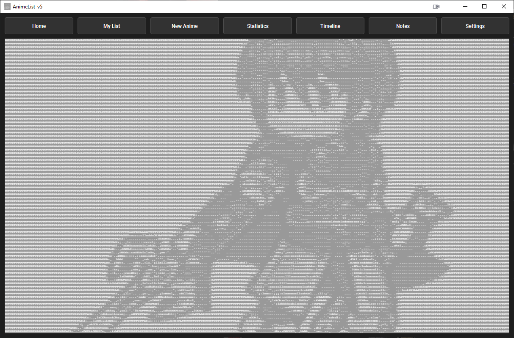

# AnimeList-v5

The successor to AnimeList-v3, the goal of this application is to provide a tool for a very hands-on approach to recording the anime
a person has watched - without limiting the user in how they define what they have watched.

>The motivation behind this project is a frustration in the structure and implementation of similar services. 
Often they provide a list format to record when and what anime the user has watched, but the user doesn't get to choose exactly what that anime is or the details about it. 
By putting all the data entry in the hands of the user, it removes those limits, and the user decides how they want their list to be represented.

The text above is an excerpt from the README.md in AnimeList-v3 repository. The motivation for this project is much the same, but what was lacking from 
that version was ease of use. The user had to manually add *everything*. This version, along with visual improvements (JavaFX > Swing), 
code improvements, and a bunch of additional features, allows the user to use [MyAnimeList.net](https://myanimelist.net/) links to
collect data. Of course, the user still has full control over their data if they so choose.

* [Installation](#installation)
* [Usage](#usage)
    + [Using the Home page](#using-the-home-page)
    + [Using the Anime Page](#using-the-anime-page)
    + [Using the List Page](#using-the-list-page)
    + [Using the Statistics Page](#using-the-statistics-page)
    + [Using the Timeline Page](#using-the-timeline-page)
    + [Using the Notes Page](#using-the-notes-page)
    + [Using the Settings Page](#using-the-Settings-page)
* [License](#license)

## Installation

Click [here](https://github.com/Blueredemption/AnimeList-v5/releases/tag/5.0.3) to download the executable jar. The user will need Java 19 or newer JRE installed
on their PC for the application to run. A proper installer for this application is something that *might* come in the future.
## Usage

### Using the Home Page
Navigating this application is done by using the buttons across the top of the window. The home page is very simple, just an image. This image is modifiable of course -
all the user needs to do is click it to pull up the edit dialog window. Pretty much everything in this application is editable, so if it looks like something that can be edited - or can take the 
user somewhere, it probably does.

Image

### Using the Anime Page

To add an anime, click the "New Anime" button on the navigation bar. A popup where the user can optionally enter a [MyAnimeList.net](https://myanimelist.net/) URL will appear.

In this application an anime is made up of occurrences (ie. seasons, movies, etc.). The first occurrence the user adds defaults as the focused occurrence, which will be important later.
The user can edit any field by clicking on it, which brings up an edit dialog that will vary for each field. The user can edit literally everything, including the image.
In the case of the occurrence name, the user will need to right-click. In all other cases any click will suffice.

What is entered is ultimately up to the user, though the more details the more accurate and useful the statistics page and sorting algorithms will be.

Images

### Using the List Page

To go to the List page, click the "My List" button on the navigation bar. The user can view it as a traditional list or as a list of images, 
select whether to see anime (the image will be the focused occurrence) or all the individual occurrences, and filter + sort by attributes.

Note: filters applied here cascade throughout the rest of the application.

Images

### Using the Statistics Page

To go to the Statistics page, click the "Statistics" button on the navigation bar. Here the user can see various statistics and aggregations, along with the user's
list ordered by rank.

Image

### Using the Timeline Page

To go to the Timeline page, click the "Timeline" button on the navigation bar. Here the user can see their episodes watched (for anime that having tracking selected) aggregated
into a stacked bar chart. This is a nice way to track watch time over large intervals. The user can change the range and how they want the occurrences represented with the controls on 
the bottom right, and switch between previous and next years with the controls on the top left and right respectively.

Image

### Using the Notes Page

To go to the Notes page, click the "Notes" button on the navigation bar. This is a simple notepad to track any miscellaneous things, if the user so chooses.

Image

### Using the Settings Page

To go to the Settings page, click the "Settings" button on the navigation bar. Here the user can change the color palette of the application, along with a few
QOL settings.

Image

## License
[MIT](https://choosealicense.com/licenses/mit/)
